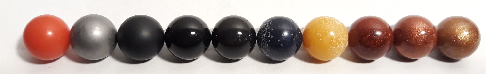
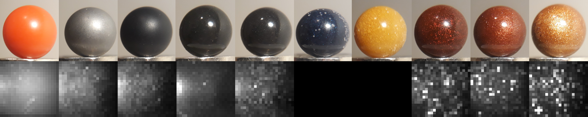
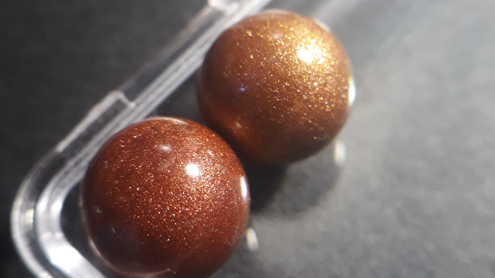
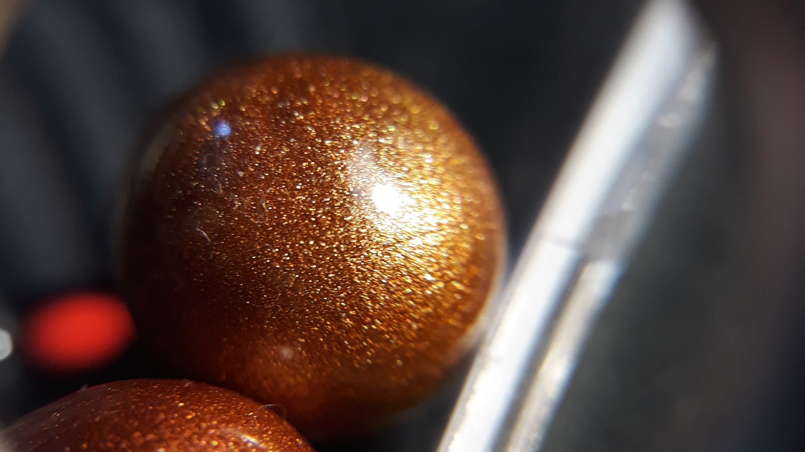
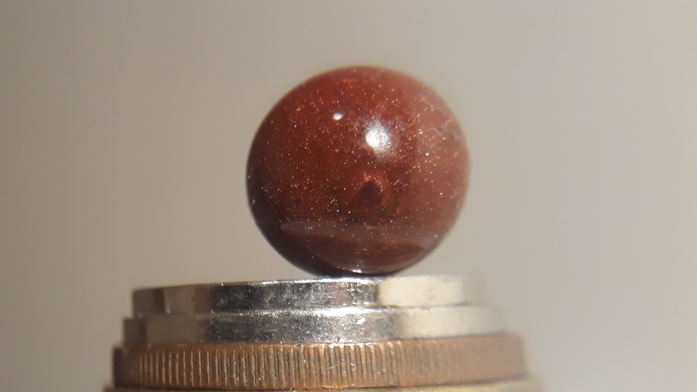
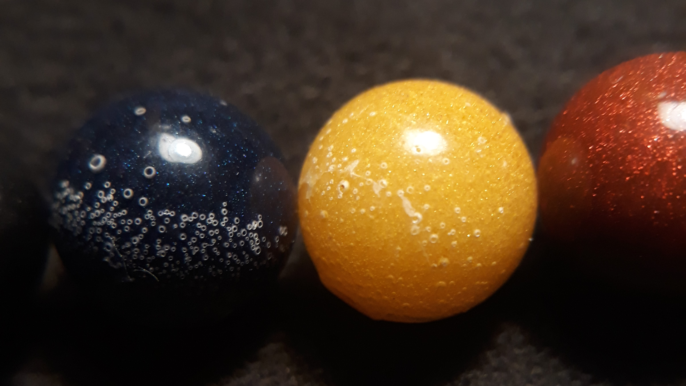
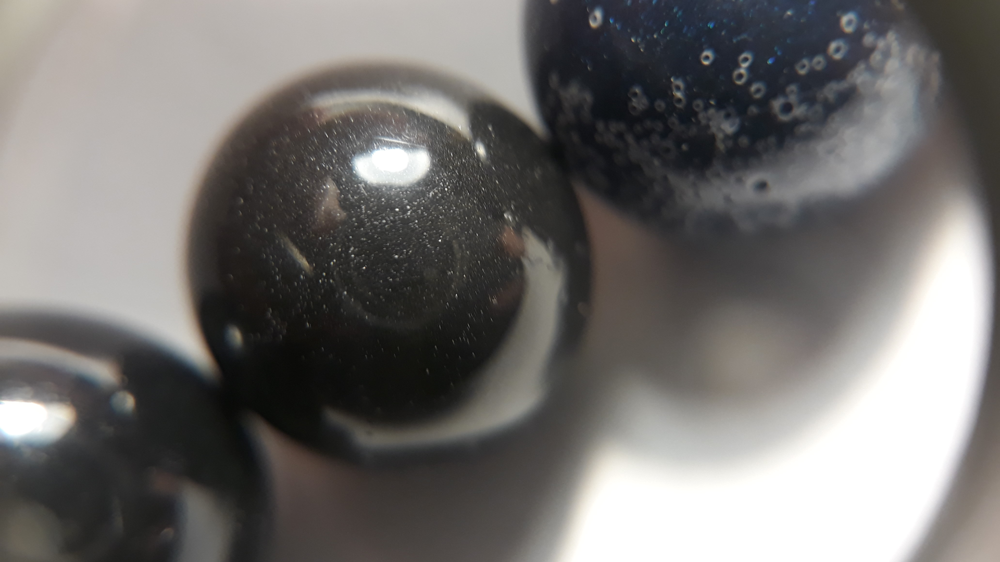
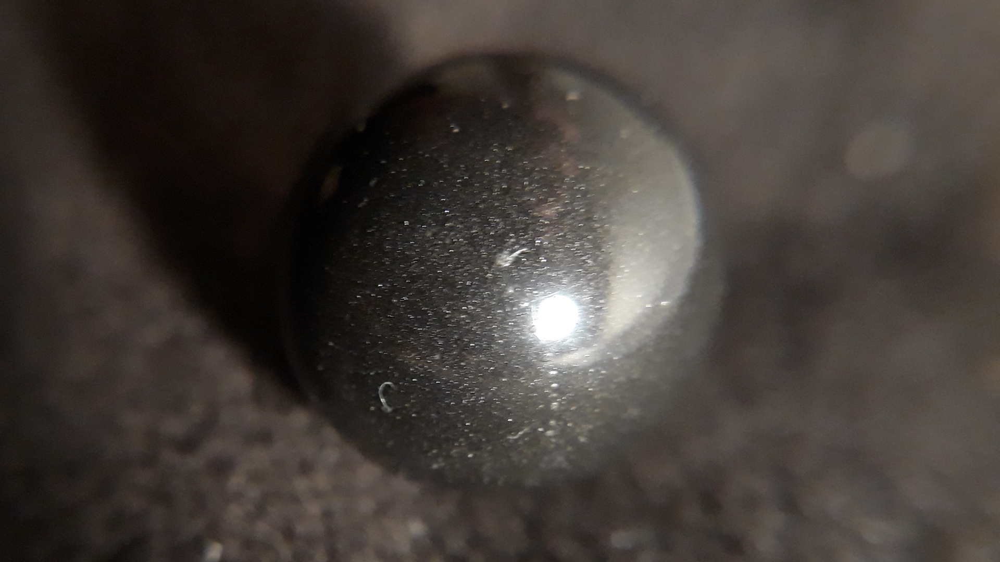
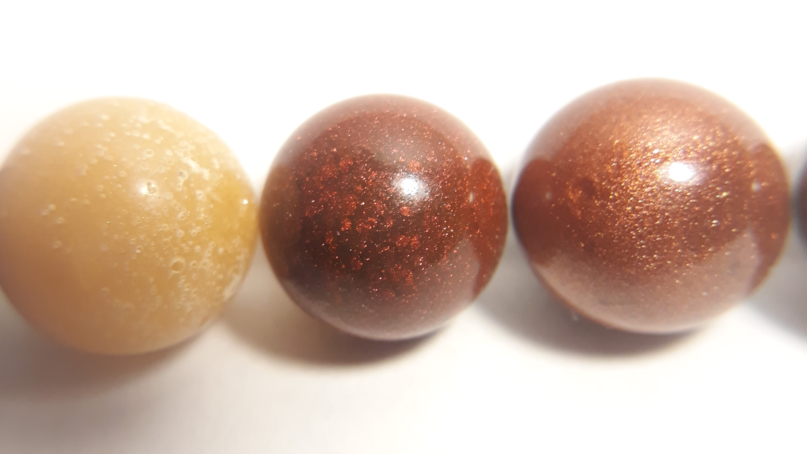
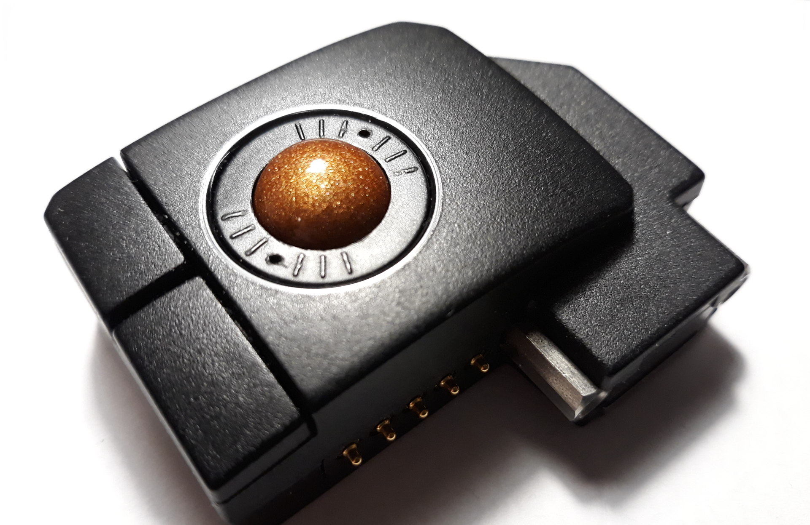

# How I made my own trackball balls

This text sums my tinkering with UHK trackball module in past months. 

The story begins in early 2021 when I received a box of UHK module prototypes. I own some standard trackballs and enjoy using them, so I was quite eager to get the trackball module in my hands and find out how good a 12mm trackball can be.

Turns out that the trackball module is pretty dexterous, and soon I found myself to prefer its responsiveness over the big heavy ball of my regular trackball. However, one thing stroke me as odd - the choice of ball.

Standard trackball balls have shiny finish which gives them very smooth experience, while reliable pickup is ensured by some sort of subsurface texture - usually fine, slightly glittering grainy texture given by a powder-based pigment. The module however came with black matte ball. Black is not exactly the most reflective colour, and matte finish could be easily felt under the thumb. 

When inquiring for reasons of the choice, I was told that shiny balls were tried, but didn't work. This information led me to a conclusion that there must be something wrong with either the used balls (which i incorrectly ruled out at first) or sensor placement. Laszlo also mentioned that he generally had problems with pickup quality at high speeds. As a result I decided to get to the bottom of things.

In the following text I will go through:

- Assessing pickup quality, using modified firmware. For instance taking snapshots of the sensor image.

- Ball prototyping, including some notes on encountered difficulties of resin casting, sanding, polishing, etc.

- Discuss findings - pigment choices and gathered data. 

I will be going into details at some places, so feel free to skip to the parts that interest you, or to the end for the most interesting results.

# Assessing pickup quality

I concluded that in order to understand why some balls work while others don't, I would need some way of measuring pickup quality. At first I thought I would write some algorithm directly in UHK right half firmware, that would measure smoothness of sensor outputs, but Laszlo pointed out that the sensor itself might provide some debugging commands. And indeed it does.

The trackball uses an ADNS-3530, which is a small SPI-controlled optical sensor, most likely intended for optical mice. The datasheet is publicly accessible in UHK repositories at https://github.com/UltimateHackingKeyboard/datasheets/blob/master/trackball/ADNS-3530.pdf. It turned out to be surprisingly easy to read and understand. (I am not a hardware engineer/programmer.)

The commands of interest are following:

- Squal - surface quality - which outputs a one byte number of recognized features in the image. This number says something about the texture of the surface, however is not the definitive measure of pickup quality.

- Shutter interval - the sensor has an adaptive shutter interval, which means that the sensor waits till enough light is picked up before doing anything with the image. This number shows as vital, since tests in practice showed that even low squal balls perform well if their shutter interval is short. I didn't try to get to the bottom of this, but it is reasonable to assume that lower shutter interval allows either for higher framerate, or at least less motion blur.

Getting these two values was easy - it sufficed to add the coresponding commands into the SPI update loop of the trackball firmware, then send results over I2C to the right half, and there to show them onto the keyboard's LED display.

- Pixel grab - this command allows reading the image as picked up by the sensor. Getting these values was a bit more laborous (we want a realtime stream straight onto the screen, right?). Resulting pipeline goes as follows:

  - Read the SPI values one by one in trackball module firmware, always checking whether the value is ready and whether or not we should reset back to first pixel.

  - When one row of matrix has been read, stop reading pixels, wait till next I2C synchronisation happens and send entire row to the right half.

  - In right half, copy the one row into an image matrix and allow querying this image via a new USB command.

  - Extend Agent with a command to query for this new command. Results in a list of 21 x 22 integers dumped into terminal.

  - Then have a shell script that takes these values and produces hex-encoded bmp image. I.e., print a hardcoded header and then dump the 462 values in hexadecimal form, while throwing in some zeroes after every line in order to get proper byte alignment. Then run it through xxd in order to obtain a binary bmp.

```
#!/bin/bash

[ "$1" == "" ] && fname="out.bmp" || fname="$1.bmp"

(
# a b ... = file size = 54 + number of pixels 
# width ...
# height ...
cat <<END
42 4D B6 05 00 00 00 00 00 00 36 00 00 00
28 00 00 00 
16 00 00 00
15 00 00 00 
01 00 18 00
00 00 00 00 50 00 00 00
C4 0E 00 00 C4 0E 00 00
00 00 00 00 00 00 00 00
END
./get-pixgrab.ts | sed 's/data: //g; s/[ ,]/\n/g;' | for y in `seq 1 21`
do
    for x in `seq 1 22`
    do
        read l
        printf '%02x ' $l
        printf '%02x ' $l
        printf '%02x ' $l
    done
    printf '00\n'
    printf '00\n'
done
) > img.hex

xxd -r -p img.hex $fname
```

  - Finally, fire up an update while loop and an instance of the `feh` image viewer with `--force-aliasing --reload 0.1` in order to get a continuous and nicely crisp stream.

```
feh -Z out.bmp --force-aliasing --reload 0.1 &
while [ true ]
do 
    ./makeImg.sh out
    sleep 0.1
done
```

# Ball prototyping

Now how I started making balls - that is, make silicon molds, cast epoxy resin balls, sand them, polish them, try them, figure out what went wrong, repeat till satisfied.

## Casting

I won't go into details of resin casting - plenty of tutorials laying around on that. 

Long story short, the procedure goes as follows - in order to create a mold, mix two silicone components, stir them and pour. When you have molds, switch to resin - exactly the same procedure - mix and pour. Last bit - find out which pigment to use. Now just repeat till you get all the details right.

Some findings:

- There are various curing agents (hardeners) for epoxy resin - I used the simplest form that hardens slowly over 24 hours. Some other variants may require heat, which may speed the process up significantly.

- Getting rid of bubbles is pretty hard, especially when you work with small amounts of resin.

- Resin is very sensitive to exact mixing ratio -> use a precise scale.

- Pipette is a great tool. The same goes for paper baking cups.

- The volume of resin shrinks by some 10% when hardening, so it is necessary to leave a small pool of resin on top of the mold and make sure that no air can be sucked into the mold when the volume shrinks. 

- The mold surface is never perfect with homemade molds.

## Sanding

When the resin has hardened, one more step was required - sanding and polishing the ball. (Since homemade molds would not yield perfect surface even if molded from a smooth ball.)

For best results, I would start sanding the ball with a 1000 grit sandpaper, then move to 2000 grit, maybe one more pass with some higher grit modeler sandpaper, then polishing paste (I used one that claims to fall apart during polishing, effectively increasing its grit over time.), and finally just a quick rub with a piece of cotton fabric. During the process:

- I would use a marker to draw a grid on the ball in order to keep track of places that have been sanded down. When all marker is gone, the iteration is complete. 

- When more control was sought, I would split the ball into two regions by tenis ball patern and then in each iteration and each region work in direction perpendicular to the previous iteration and the other region.

- In every iteration, I would use 30x and 60x loupes to check the results. If insufficient, I would go back by one or more iterations and repeat till all surface flaws were gone.

If done properly, this process would yield almost perfectly smooth balls.

One more issue regarding sanding - it tends to make the ball smaller, and also to spoil the shape. For this reason, for most balls I would have to decide whether I wanted good shape (but tolerate significant surface flaws) or good surface finish (but smaller size and worse shape). (Bad shape would make rolling the ball much harder as the ball is sunk deep in the tripod bearings and therefore tends to get sort of stuck in there if shape projection changes.) Ways to aleviate the problem:

- Doubleshot the ball - I would push a casted ball once again into the mold after wetting the mold with clean resin. This would add approximately 0.1mm to the ball size which could later be sanded off. Also, this would improve overall shape.

- Perform all sanding iterations very carefully, sanding down as little material as possible.

Getting the entire process right took approximately 20 balls, maybe more. I assume there are better ways of getting same results, but those out of reach of my knowledge and probably equipment too.

## Pigments

The effect which I was trying to achieve is generally described by word "metallic". I tried the following:

- Mixing in some metallic acrylic colours (Jacquard and Lumiere). (Had them from another project.) Balls hardened without problem and produced relatively nice texture, but the acrylic base caused lots of small bubbles appear on the surface (, whose cause took some time to uncover).

- Graphite powder. (Another standard art supply.) Produced black ball, which would sparkle under bright light. Pickup quality wise, this ball turned to be just as good as the black matte ball, but with shiny surface!

- Some nail powder pigment. Worked fine, except the resulting hue was not very nice.

- Finally, I ordered and tried some mica pigment. These pigment powders are made from grinded mica stone that is covered with some metal oxide (exact choice depending on desired colour). This approach gives pigment particles that have flat sharply-reflective faces. In our case, their size was approximately 5-20 um. Just what we needed. Resulting balls turned out working perfectly.

# Results

Finally, some data and pictures. Here is full set of tested balls:



And here go data:

 |  | Min squal | Shutter | Observed rating | Computed rating |
 |  :----- | :-------------:  | :-------------:  |  :----------:  |  :-----------:  |
 | Red Plastic prod ball | 13 (avg 30) | 200 | 100 | 65 |
 | Steel prod ball | 40 | 100 | 500 | 400 |
 | Matte black resin prod ball | 45 | 400 | 170 | 128 |
 | Polished black resin prod ball | 20 | 1000 (600-2000) | 40 | 20 |
 | Shiny graphite black ball | 60 | 400 | 170 | 150 |
 | Blue (J&L) ball | 60 | 600 (400-2000) | 100 | 100 |
 | Yellow (J&L) ball | 70 | 60 | 1400 | 1166 |
 | Shiny red nail powder ball | 110 | 200 (100-500) | 500 | 550 |
 | Shiny wine red mica powder ball | 80 | 100 (60-300) | 600-1500 | 800 |
 | Shiny bronze mica powder ball | 100 | 60 (30-150) | 1300 | 1666 |

And images picked up from sensor:



I guess picture and table of data speaks for itself. Yet, some notes:

- Brightness of sensor images is normalized since sensor itself alters its shutter interval in order to pick up enough light. Keep in mind that some of these outputs in reality needed even as much as twenty times longer exposition than other, yet all are shown at the same brightness. I didn't try to correct for this, although I probably should have done so.

- The rating is computed as `squal*1000/shutter`. It is quite arbitrary measure of quality. Shutter is probably the most important column here.
 
- As mentioned before, the transcluent red ball produced very good results thanks to reflecting a lot of light and therefore having low shutter value, even despite very low squal.

- In reality, the graphite ball is not entirelly black. Rather dark gray, and glitters in faint, very fine manner. 

- The graphite ball's pickup properties are very similar to the basic black prod ball. Yet, this is achieved with shiny surface, which is a notable improvement.

- Another interesting thing is very high shutter for the polished black resin ball. It tells us that there is no problem with the way surface is lit and the way sensor placed, i.e., that the sensor is not picking up reflections and is probably well focused (at least wel enough). 

In total, I produced arount 20-30 balls - most of medicore quality. In the end I produced four pieces of relatively representative quality. I have kept two for own modules, and sent the other two (together with some lower quality pieces) to Laszlo.

Some more pictures:

- all the balls lined up, one of each type:

 

- closeups of the good guys:

 

- effect caused by resin shrinking around mold entrance, and bubbles caused by acrylic paint adition:

 

- some attempts to capture the graphite ball:

 

- and last random two:

 


# resources, links, advertisement:

- Code available at https://github.com/kareltucek/uhk-squal_research-agent and https://github.com/kareltucek/uhk-squal_research-firmware

- Construction of bmp via hex editor - http://turrier.fr/tutoriels/form_02/create-a-bitmap-file-with-an-hexadecimal-editor.html

- The ultimate hacking keyboard official page - https://ultimatehackingkeyboard.com/

- My fork of uhk firmware featuring macro language that makes this keyboard customizable even without having to dive into C code - https://github.com/kareltucek/firmware

